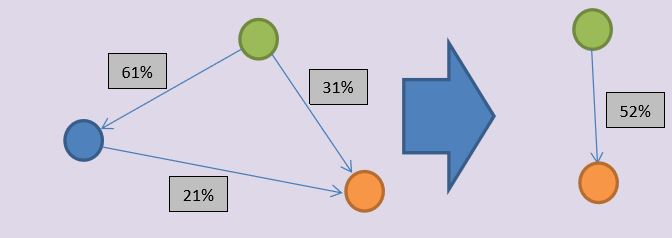
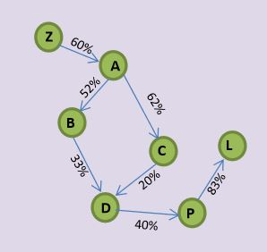
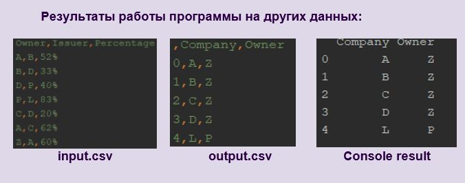

Задача нахождения иерархии в графе
---

## Условие:  
Дан массив Shares(Owner String, Issuer String, Percentage Float) 
владения компаниями акциями друг друга. 
В массиве три поля: наименование компании-владельца акций, 
наименование компании-эмитента акций, процентная доля владения. 
Компании могут владеть акциями иерархически (компания родитель владеет дочерними компаниями, 
а через них их дочерними и т.д.), а также взаимно владеть акциями друг друга. 
Если компания А владеет акциями Б, а Б владеет акциями В, то А владеет долей Б в компании В, если доля А в Б больше 50%. 
Доли владения можно суммировать. 
 
##Требуется: 
Необходимо написать программу, которая выведет все компании, у которых есть владелец контрольного пакета 
(непосредственный или через другие компании), имеющий более 50% 
акций этой компании, и указать всех таких владельцев. 
Оптимизированный алгоритм приветствуется. 

##Пример: 
###Формат ввода: 
|Owner      |Issuer      |Percentage |
|-----------|------------|-----------|
|ООО Материк|ООО Остров  |65.050%    |
|ООО Материк|ООО Горы    |54.009%    |
|ООО Горы   |ООО Лес     |17.120%    |
|ООО Остров |ООО Лес     |40.334%    |
|ООО Лес    |ООО Материк |1.002%     |

###Формат вывода:
 |Company | Owner |
 |--------|-------|
 |ООО Остров |ООО Материк |
 |ООО Горы |ООО Материк |
 |ООО Лес |ООО Материк |
 
 ##Алгоритм
 
 1. В качестве структуры данных выбираем ориентированный граф. 
 2. Строим матрицу смежностей для данного графа, в каждой ячейке которой хранится процентная доля владения (строки – владельцы, столбцы – эмитенты). 
 3. Начинаем обход этой матрицы с первой строки  
 4. Если рассматриваемая ребро (ячейка матрицы) > 50%, то вершина поглощает своего соседа (дочернюю компанию), при этом все рёбра, идущие от соседа становятся рёбрами вершины, а данное ребро заносится в список «владелец-сын».   
 5. Если из вершины-владельца есть возможность прийти в вершину-эмитента разными путями, то ребра, идущие в дочернюю вершину складываются, пример ниже.  
 

   
 
 
 
 
 